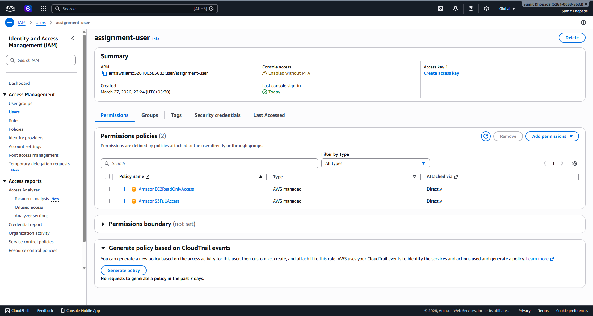
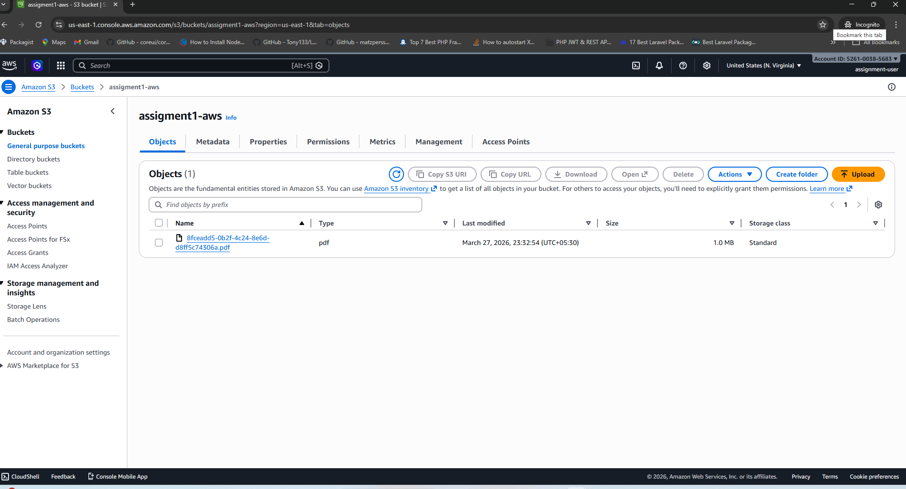
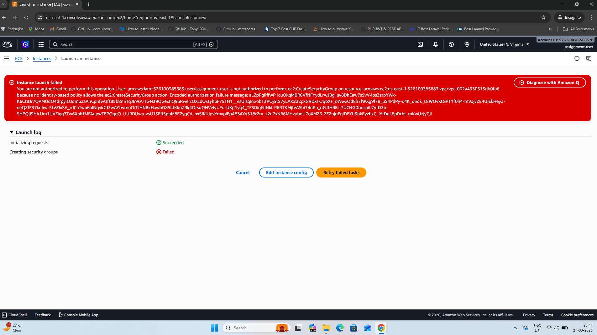

# 📘 AWS Assignment 1: IAM User & Permissions

## 👤 Author
**Sumit Khopade**

---

## 🎯 Objective
Create an IAM user in Amazon Web Services (AWS) and assign:
- Full access to S3  
- Read-only access to EC2  

---

## 🛠️ Services Used
- IAM (Identity and Access Management)
- S3 (Simple Storage Service)
- EC2 (Elastic Compute Cloud)

---

## 🔹 Steps Performed

### 1️⃣ IAM User Creation
- Created a new IAM user: `assignment-user`
- Enabled AWS Management Console access

---

### 2️⃣ Assign Permissions

Attached AWS managed policies:

- `AmazonS3FullAccess`  
  → Provides full access to S3 resources  

- `AmazonEC2ReadOnlyAccess`  
  → Allows viewing EC2 resources but restricts modifications  

---

### 3️⃣ Verification

#### ✅ S3 Access
- Successfully accessed S3  
- Uploaded and managed objects  

#### ❌ EC2 Access
- Attempted to launch EC2 instance  
- Received **Access Denied error**

User is not authorized to perform: ec2:RunInstances

---

## 📸 Screenshots

### IAM User & Permissions

### S3 Access

### EC2 Access Denied

---

## 🔍 Key Observations

- IAM user can:
  - View EC2 instances ✔️  
  - Access S3 fully ✔️  

- IAM user cannot:
  - Launch EC2 instances ❌  

---

## ✅ Conclusion

- Successfully implemented IAM user with required permissions  
- Verified:
  - S3 full access works correctly  
  - EC2 access is restricted (read-only)  

---

## 📚 Key Learnings

- IAM policies enforce access control in AWS  
- AWS Console may allow navigation, but actions are restricted at API level  
- Follow Principle of Least Privilege for better security  

---

## 🚀 Bonus Insight

This assignment demonstrates Role-Based Access Control (RBAC) using IAM policies in AWS.

---

## 📂 Project Structure
aws-assignment-1/
│── README.md
│── iam-user.png
│── s3-access.png
│── ec2-denied.png

---

## ⭐ How to Reproduce

1. Login to AWS Console  
2. Go to IAM → Create user  
3. Attach policies:
   - AmazonS3FullAccess  
   - AmazonEC2ReadOnlyAccess  
4. Login using IAM user  
5. Verify:
   - S3 → Full access  
   - EC2 → Read-only  
